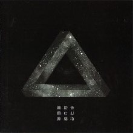
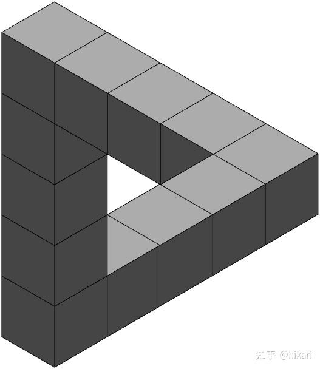

# IDEA9103
 Quiz8

# Quiz 8

## Part 1

After I browsed through many images I chose an album image. This image is from the album cover of singer Kenneth Chen. The album is called "三角渡". 

Included in the picture is the universe as well as the Penrose Triangle. And my current idea is very similar to these elements, I want to simulate the universe through code, which involves colours as well as image layout. And I want to create a Penrose Triangle or a Möbius Ring.
1. 
2. 

I might use random generation to simulate the stars in the universe, but for realism I need to tweak the colours, strokes and many other parameters, which also better allows me to consolidate my ability to write code.
### Part 2

I found some code on the Penrose Triangle, which helped me a bit in regards to the construction of the image. At least I can see how the most basic graphs are generated.
1. ### Code of Penrose triangle 
```
 function penroseTriangle
% @author : slandarer
vertex=[0 0 0;0 0 1;0 1 0;0 1 1;1 0 0;1 0 1;1 1 0;1 1 1];
facet=[1 2 4 3;1 2 6 5;1 3 7 5;2 4 8 6;3 4 8 7;5 6 8 7];
faceColor=[.9,.9,.9];
for i=1:5,patch('Vertices',vertex+[i,3,0],'Faces',facet,'FaceColor',faceColor);end
for i=1:4,patch('Vertices',vertex+[1,3,i],'Faces',facet,'FaceColor',faceColor);end
for i=1:2,patch('Vertices',vertex+[1,3-i,4],'Faces',facet,'FaceColor',faceColor);end
vertex=[0 1 0;0 0 1;0 1 0;0 1 1;1 1 0;1 0 1;1 1 0;1 1 1];
patch('Vertices',vertex+[1,0,4],'Faces',facet,'FaceColor',faceColor)

ax=gca;hold on;axis off;light
ax.XLim=[0,6];
ax.YLim=[0,6];
ax.ZLim=[0,6];
ax.DataAspectRatio=[1 1 1];
set(gcf,'Color',[1,1,1])
view(-45.1099,35.3223)
end
```
   

2. #### Code of Penrose triangle form P5.js
```function setup() {


  createCanvas(800, 600);

     // forma 1
    stroke(2);
    fill( 0);
   beginShape();

        vertex( 438,40  );
        vertex( 362,40  );
        vertex( 100,492 );
        vertex( 553,492 );
        vertex( 519,433 );
        vertex( 211,433 );
       

    endShape();
  
     // forma 2
   stroke(2);
    fill( 255);
   beginShape();

        vertex( 438,40  );
        vertex( 211,433 );
        vertex( 281,433 );
        vertex( 435,167 );
        vertex( 661,559 );
        vertex( 700,492 );
        vertex( 438,40  );
       

    endShape();
  
  // forma 3
    stroke(2);
    fill( 127);
   beginShape();

        vertex( 553,492 );
        vertex( 100,492 )
        vertex( 137,560 );
        vertex( 661,559 );
        vertex( 435,167 );
        vertex( 400,227 );
        vertex( 553,492 );
       

    endShape();
}
```
[Link of the code](https://editor.p5js.org/Luca.Terenziani/sketches/z9v60VVzI)

//test test
